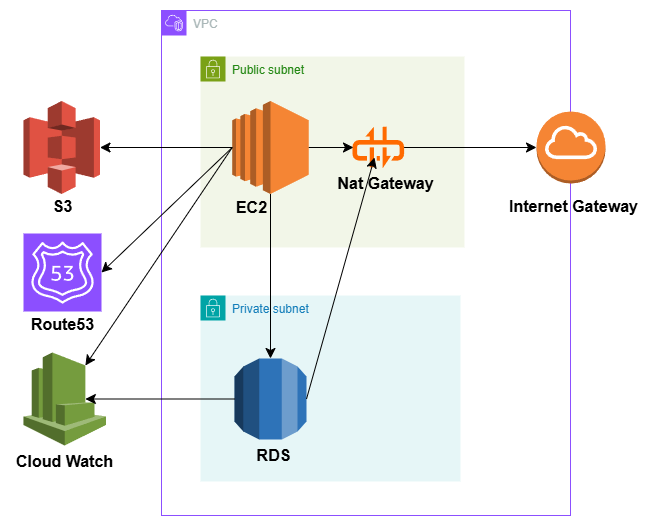

# Step 1: GUI構築詳細

## ・アーキテクチャ図

## ・設計意図

- Public Subnet に NAT Gateway / EC2 を配置し、外部との安全な通信を確保
- RDS は Private Subnet に隔離し、セキュリティ重視
- 外部サービス（S3, Route 53, CloudWatch）との通信設計
- RDS → CloudWatch、RDS → NAT も明示

## ・実行済み構築内容

- VPC作成
- サブネット作成
- EC2インスタンス作成とSSH接続
- S3バケット作成とアクセス設定
- RDSのプライベート配置と接続
