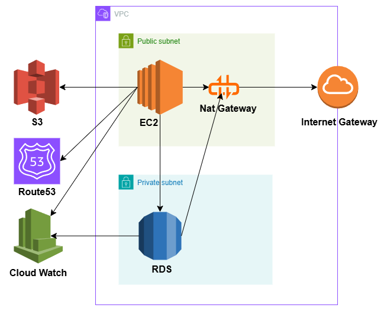

# Step2：Terraformによるインフラ自動構築（Infrastructure as Code）

## 1. 概要

本ステップでは、Step1でGUIにより構築したAWSインフラ構成を、  
**Terraformを用いてコードで再現** (Infrastructure as Code)します。

再現性のある構成・変更の容易さ・構成の明確化により、  
「手で作れる」だけではなく「設計通りに再構築できる」エンジニアであることを証明します。

---

## 2. 構成図（Step1）

本ステップのTerraformコードは、以下の構成図に基づいています。  
GUI構築と同様のリソースをコードで再現することを目的とします。



---

## 3. Terraformディレクトリ構成

``` step2_terraform_build/ ├── main.tf # メインリソース定義 ├── variables.tf # 変数の宣言 ├── outputs.tf # 出力値の定義 ├── terraform.tfvars # 実際の変数値 ├── provider.tf # AWSプロバイダ設定 ```

---

## 4. Terraformで構築するAWSリソース

| リソース | 説明 |
|--|--|
| VPC | `aws_vpc`：ネットワークの土台となる仮想ネットワーク |
| サブネット | `aws_subnet`：Public / Private に分離して配置 |
| IGW / NAT / Route Table | `aws_internet_gateway`, `aws_nat_gateway`, `aws_route_table`：外部通信構成 |
| EC2 | `aws_instance`：Public Subnet に配置、SSH接続検証 |
| RDS | `aws_db_instance`：Private Subnet に配置、セキュリティ設計を重視 |
| S3 | `aws_s3_bucket`：静的ホスティングやログ用途を想定 |
| CloudWatch | `aws_cloudwatch_log_group`：監視設計の一環として最小構成で設置 |

---

## 5. 設計意図

- **設計 → 構成図 → コード化**の流れを忠実に実施
- GUI操作では見えにくい構造や依存関係を、IaCによって明示化
- 「なぜその構成にしたか」を言語化し、構築力＋設計力を両立

---

## 6. 実行ステップ（ローカルでの基本コマンド）

```bash
terraform init         # 初期化
terraform plan         # 差分の確認
terraform apply        # 実行
terraform destroy      # 構成の削除
