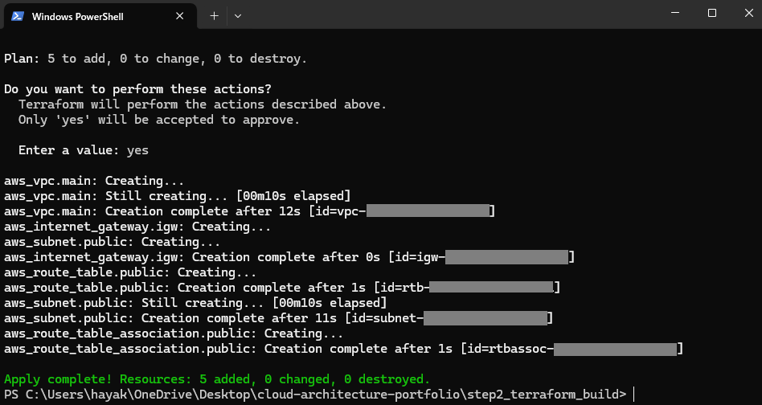

# Step2：Terraformによるインフラ自動構築（Infrastructure as Code）

## 1. 概要

本ステップでは、Step1でGUIにより構築したAWSインフラ構成を、  
**Terraformを用いてコードで再現** (Infrastructure as Code)します。

再現性のある構成・変更の容易さ・構成の明確化により、  
「手で作れる」だけではなく「設計通りに再構築できる」エンジニアであることを証明します。

---

## 2. 構成図（Step1）

本ステップのTerraformコードは、以下の構成図に基づいています。  
GUI構築と同様のリソースをコードで再現することを目的とします。


---

## 3. Terraformディレクトリ構成

```
step2_terraform_build/
├── main.tf            # メインリソース定義
├── variables.tf       # 変数の宣言
├── outputs.tf         # 出力値の定義
├── terraform.tfvars   # 実際の変数値
├── provider.tf        # AWSプロバイダ設定
```

---

## 4. Terraformで構築するAWSリソース

| リソース | 説明 |
|--|--|
| VPC | `aws_vpc`：ネットワークの土台となる仮想ネットワーク |
| サブネット | `aws_subnet`：Public / Private に分離して配置 |
| IGW / NAT / Route Table | `aws_internet_gateway`, `aws_nat_gateway`, `aws_route_table`：外部通信構成 |
| EC2 | `aws_instance`：Public Subnet に配置、SSH接続検証 |
| RDS | `aws_db_instance`：Private Subnet に配置、セキュリティ設計を重視 |
| S3 | `aws_s3_bucket`：静的ホスティングやログ用途を想定 |
| CloudWatch | `aws_cloudwatch_log_group`：監視設計の一環として最小構成で設置 |

---

## 5. 設計意図

- **設計 → 構成図 → コード化**の流れを忠実に実施
- GUI操作では見えにくい構造や依存関係を、IaCによって明示化
- 「なぜその構成にしたか」を言語化し、構築力＋設計力を両立

---

## 6. 実行ステップ（ローカルでの基本コマンド）

```bash
terraform init         # 初期化
terraform plan         # 差分の確認
terraform apply        # 実行
terraform destroy      # 構成の削除
```

---

## 7. 実行結果（Applyログ）

Terraformにより、以下の5つのリソースが正常に構築されました。



```bash
Apply complete! Resources: 5 added, 0 changed, 0 destroyed.
```

- VPC（main-vpc）
- Public Subnet（public-subnet）
- Internet Gateway（main-igw）
- Route Table（public-route-table）
- Route Table Association（public-subnet との紐付け）

---

## 8. AWSマネジメントコンソールでの確認手順

Terraformにより構築されたリソースは、AWSマネジメントコンソール（東京リージョン）にて以下の通り確認済です：

1. **VPC** → 名前：`main-vpc` が存在すること
2. **サブネット** → 名前：`public-subnet`、CIDRブロックの確認
3. **インターネットゲートウェイ（IGW）** → 名前：`main-igw` が VPC にアタッチされていること
4. **ルートテーブル** → 名前：`public-route-table` にサブネットが関連付けられていること

**補足**：「Name」タグが非表示の場合は、列の表示設定をカスタマイズし、タグ列を有効化してください。

---

## 9. 補足：未構築リソースとその理由

本ステップの主目的は、「Terraformによるネットワーク基盤の自動構築」と「設計意図の証明」です。  
以下のリソースについては `.tf` に記述することで構成の理解を示しつつ、コスト・用途の観点から apply 実行は省略しています。

| リソース | 補足内容 |
|--|--|
| **EC2** | Public Subnetに配置可能。SSH接続を含めた構築経験あり。実行コストが少ないため、必要に応じて追加可能。 |
| **RDS** | Private Subnet構成＋NAT Gatewayを伴う。コスト発生のため実構築は省略。設計意図および `.tf` で対応予定。 |
| **NAT Gateway** | Elastic IPと組み合わせて構成。Private環境との通信に使用予定。 `.tf` への記述のみで対応。 |
| **S3 / CloudWatch** | 記述理解済。必要に応じて構築追加可能（無料枠内での活用も検討）。 |

> このポートフォリオは、設計 → コード化 → 構築 → 説明 の一連の流れを通して、実践力と再現性を証明することを目的としています。
