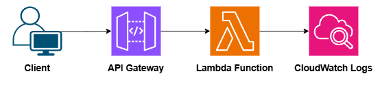
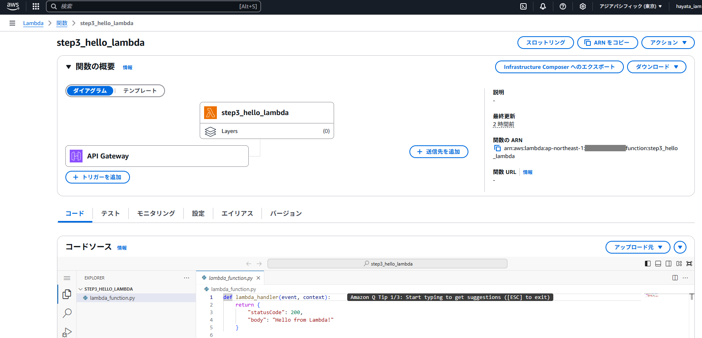

# Step3: Serverless Architecture (Terraform)

## 1. 概要 - Overview

本ステップでは、**API Gateway + Lambda** をTerraformで構築し、完全サーバレスなアーキテクチャを再現しています。  
採用担当者や技術者が一目で理解できるよう、構成図とコードによって「設計力 × 実装力 × 再現性」を証明します。

---

## 2. 構成図 - Architecture Diagram

以下は本構成の全体像です。（クリックで拡大表示可能）



- クライアントからのリクエストをAPI Gatewayで受け取り、Lambdaに転送
- Lambdaは「Hello from Lambda!」を返す簡易構成
- CloudWatch Logsに自動ログ出力

---

## 3. 使用Terraformリソース - Main Resources

| リソース名                     | 説明                            |
|------------------------------|---------------------------------|
| `aws_lambda_function`        | Lambda本体                      |
| `aws_apigatewayv2_api`       | HTTP API Gateway                |
| `aws_apigatewayv2_integration` | API GatewayとLambdaの接続設定  |
| `aws_apigatewayv2_route`     | エンドポイント（例：/hello）   |
| `aws_apigatewayv2_stage`     | ステージ（例：dev）            |
| `aws_lambda_permission`      | API Gateway → Lambda呼び出し権限 |
| `aws_iam_role`               | Lambda実行用ロール             |

---

## 4. Lambda関数内容（Python例）

```python
def lambda_handler(event, context):
    return {
        "statusCode": 200,
        "body": "Hello from Lambda!"
    }
```

---

## 5. デプロイ実行ログ - Terraform Apply

以下は `terraform apply` 実行結果の一部です。  
作成されたリソースとAPIエンドポイントが確認できます。

📸 `terraform_apply_step3_gateway_result.png`

```bash
Apply complete! Resources: 5 added, 0 changed, 0 destroyed.

Outputs:

api_endpoint = "https://lmtiz2053l.execute-api.ap-northeast-1.amazonaws.com/dev/hello"
```

---

## 6. 動作確認 - API Endpoint Test
ブラウザまたはcurlで以下のURLにアクセスすると、Lambda関数の実行結果が返ってきます：

🔗 https://lmtiz2053l.execute-api.ap-northeast-1.amazonaws.com/dev/hello

```json
{
  "statusCode": 200,
  "body": "Hello from Lambda!"
}
```

---

## 7. GUI確認（AWSマネジメントコンソール）

Terraformによって構築されたリソースが、AWSマネジメントコンソール上でも正しく確認できました。

📸 Lambda関数のGUI画面（クリックで拡大表示）：



- 関数名：`step3_hello_lambda`
- リージョン：`ap-northeast-1`（東京）
- 関数ARN：`arn:aws:lambda:ap-northeast-1:************:function:step3_hello_lambda`（一部伏字）
- GUI上でもTerraformでの定義通りに反映されていることを確認済みです

> 🔐 アカウントID部分は伏字処理しています（セキュリティ対策のため）

---

