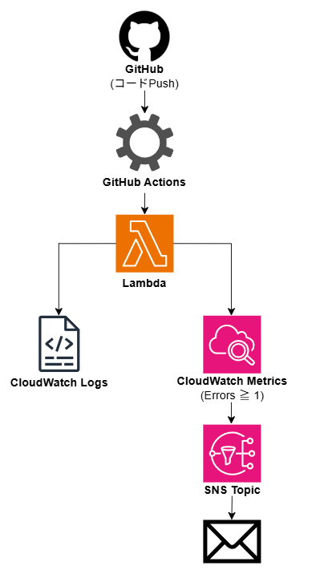
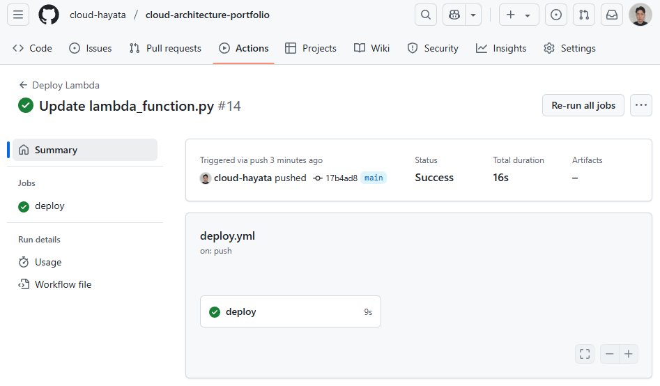
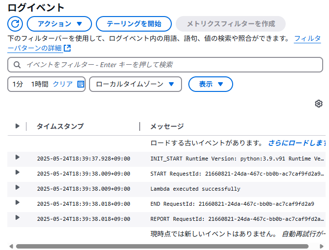
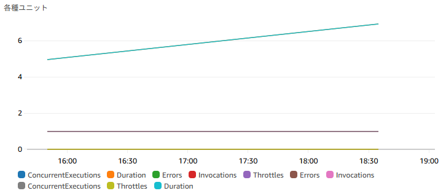
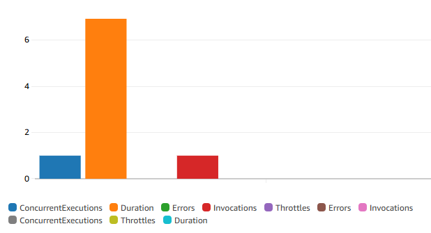
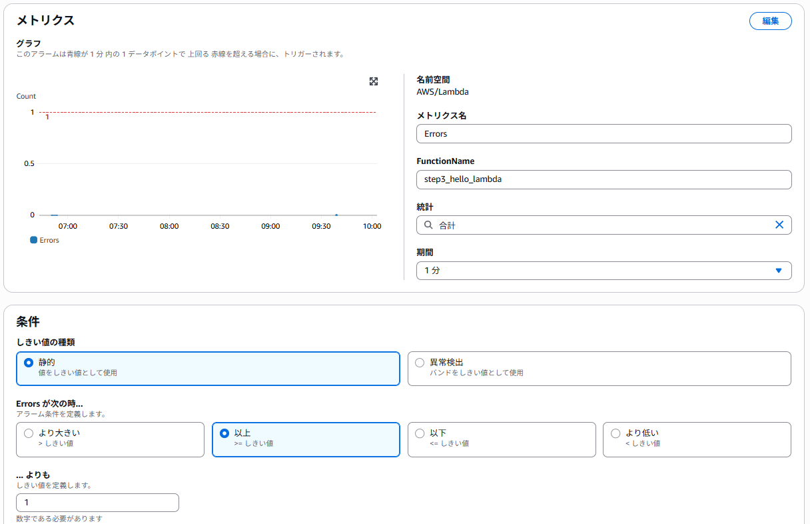
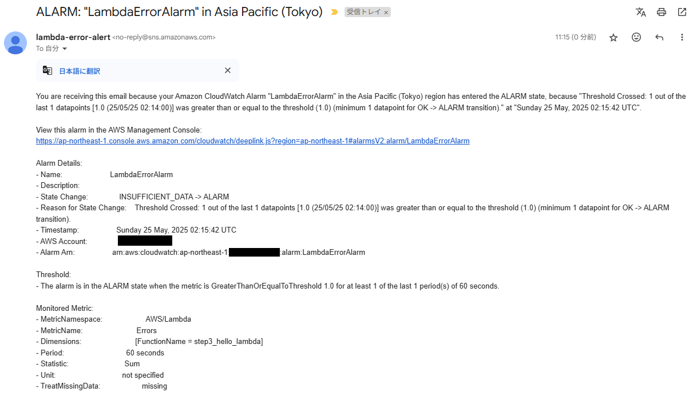

# Step4：CI/CD & 監視設計（Lambda × GitHub Actions × CloudWatch）

---

## 1. 目的

このステップでは、以下の構成を通じて「構築 → 自動化 → 監視 → 通知」を一貫して行える即戦力DevOpsスキルを証明する。

- GitHubでのコードPushをトリガーにLambdaが自動更新（CI/CD）
- CloudWatchにログ・メトリクスを可視化
- CloudWatch Alarm＋SNSで異常通知

---

## 2. 全体構成図

以下の図は、本ステップで構築したCI/CDおよび監視の全体像を示す：



---

## 3. CI/CD構成（GitHub Actions）

- `.github/workflows/deploy.yml` にて定義
- `lambda_function.py` を更新してPushするだけで、自動でLambdaがデプロイされる

📸 CI/CD成功時のログ：



---

## 4. Lambda 実行ログ（CloudWatch Logs）

- Lambda実行時に `print()` 出力された内容を確認

📸 実行ログ：



---

## 5. メトリクス監視（CloudWatch Metrics）

- Lambdaの実行時間や呼び出し回数をメトリクスとして収集・可視化

📈 実行時間（Duration）  


📈 呼び出し回数（Invocations）  


---

## 6. アラーム通知（CloudWatch Alarm × SNS）

### ✅ 設定内容

| 項目               | 設定値                      |
|--------------------|-----------------------------|
| 名前空間            | AWS/Lambda                  |
| メトリクス名        | Errors                      |
| 関数名              | step3_hello_lambda          |
| 統計                | 合計（Sum）                |
| 期間                | 1分                         |
| しきい値の種類       | 静的                        |
| 条件                | Errors ≥ 1（エラー検知時） |

📸 アラーム設定画面：



---

## 7. 通知結果（メール）

📸 実際に届いたアラートメール（SNS経由）：



---

## 8. まとめ

このステップを通じて、以下が可能になった：

- コード変更による自動デプロイ（GitHub Actions）
- 実行結果の可視化（CloudWatch Logs / Metrics）
- エラー検知時の通知（Alarm + SNS）

---

## 9. ファイル構成（本フォルダ内）

```plaintext
step4_ci_cd_build/
├── lambda_function/
│   └── lambda_function.py
├── README.md
├── step4_ci_cd_success.png
├── step4_logs_execution.png
├── step4_metrics_duration.png
├── step4_metrics_invocations.png
├── step4_alarm_setting.png
├── step4_alarm_email.png
├── step4_architecture_diagram.png
