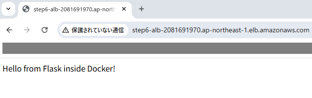
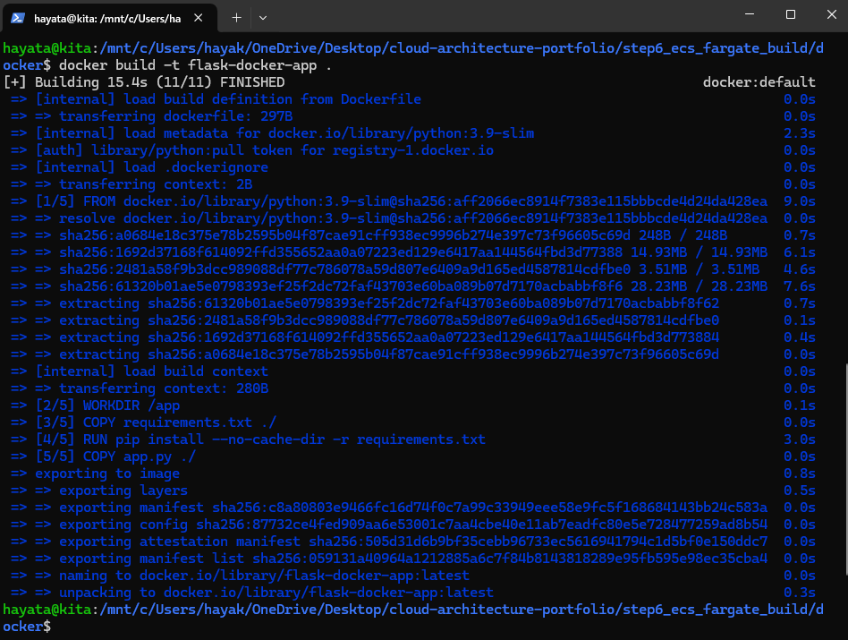
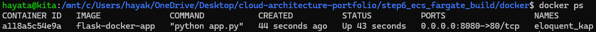
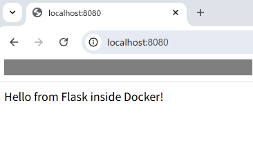
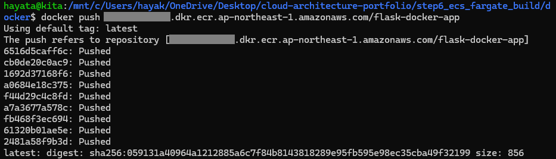
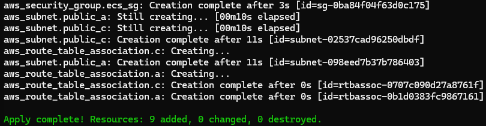
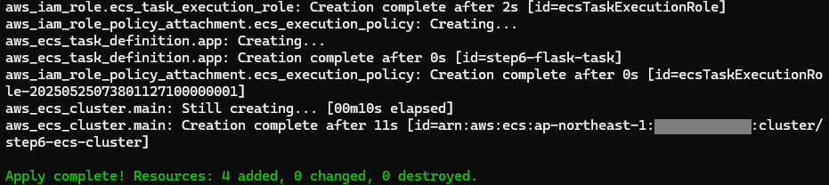
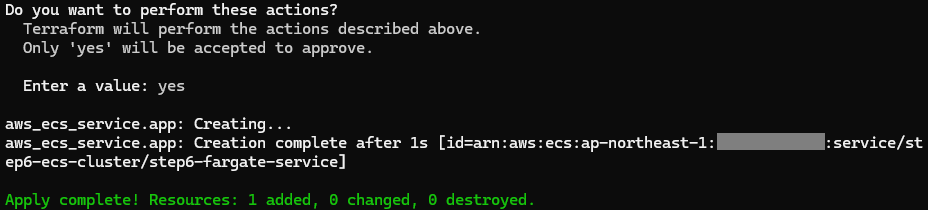
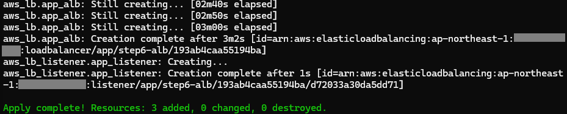

# Step6: FlaskアプリをECS/Fargateに本番デプロイ＋CI/CD＋監視構築

このプロジェクトは、AWS上で **FlaskアプリケーションをDockerでコンテナ化**し、  
**ECS / Fargate に本番環境レベルでデプロイ → GitHub ActionsでCI/CD → CloudWatchで監視**までを一貫して構築するポートフォリオです。

---

## 1. 使用技術スタック

| カテゴリ       | 使用サービス / ツール                     |
|--------------|------------------------------------------|
| インフラ構成   | VPC, Subnet, IGW, Security Group         |
| コンテナ実行環境 | Docker, ECS (Fargate), ECR               |
| 負荷分散       | ALB (Application Load Balancer)         |
| 自動デプロイ   | GitHub Actions                          |
| ログ & 監視    | CloudWatch Logs, CloudWatch Alarms      |

---

## 2. アーキテクチャ概要図



---

## 3. 構築ステップと成果物

### 3-1. FlaskアプリのDocker化

- `Dockerfile` と `app.py` を用意し、ローカルでビルド＆実行
- コンテナ起動とブラウザ表示確認

📸 スクリーンショット:
- Dockerイメージをビルドしたログ  
  
  
- ビルドしたコンテナを8080番ポートで起動  
  
  
- ブラウザで `localhost:8080` にアクセスしてアプリを表示  
  

---

### 3-2. ECRへのPush

- AWS CLIでECRにログイン
- DockerイメージをECRにPush

📸 スクリーンショット:


---

### 3-3. ECS / Fargate構築（Terraform）

- VPC, Subnet, SG, ECS Cluster, Task定義、Serviceなどを構築

📸 スクリーンショット:
- VPCとSGをTerraformで構築  
  
  
- ECSクラスター作成完了  
  
  
- Fargateタスクが実行中  
  

---

### 3-4. ALB構成とアクセス確認

- TerraformでALB（Application Load Balancer）とTarget Groupを構築し、ECS Serviceと接続
- ALBのDNS名にアクセスし、ECS上のFlaskアプリがブラウザで動作していることを確認

📸 スクリーンショット:

- TerraformでALBを構築し、完了したログ（PowerShell出力）  
  

- ALBのDNS名にブラウザからアクセスし、Flaskアプリが表示された画面  
  

---

### 3-5. GitHub ActionsでCI/CD構築

- `deploy-ecs.yml` により、自動ビルド＆デプロイを実現
- Push → Build → ECR Push → ECS Serviceを更新

---

### 3-6. CloudWatchによる監視

- CloudWatch Logs:
  - `/ecs/step6-flask-log-group` にログを出力
- CloudWatch Alarm:
  - `high-cpu-usage-alarm`（CPU使用率が80%を超えると通知）

---

## 4. デプロイ確認

- ALB経由でアプリにアクセスし、 `Hello from Flask inside Docker!` を確認済

📸 スクリーンショット:


---

## 5. ディレクトリ構成（概要）

```plaintext
cloud-architecture-portfolio/
└── step6_ecs_fargate_build/
├── docker/
│ ├── app.py
│ ├── Dockerfile
│ └── requirements.txt
├── terraform/
│ └── main.tf
├── .github/
│ └── workflows/
│ └── deploy-ecs.yml
├── images/
└── README.md
```

---

## 6. 今後の改善ポイント

- ALBのHTTPS対応（ACM + Route53）
- ECS Auto Scaling導入
- CloudWatch Alarm → SNS or Slack通知連携
- Secrets ManagerでECSの環境変数管理
- デプロイ結果をGitHub Actionsから通知

---

## 7. Author

この構成は、AWSクラウドエンジニア転職を目指す個人のポートフォリオとして構築されました。  
設計レビュー・改善提案など大歓迎です！
